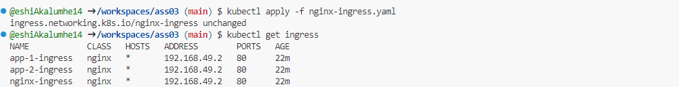
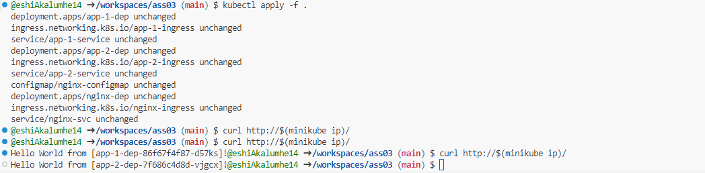

#### Name: Eshilama Akalumhe
#### UCID: 30140722

# Kubernetes Configuration
This project includes several Kubernetes configuration files for setting up a load-balanced application with two backends, `app-1` and `app-2`.

## Steps 
- Apply the `nginx-dep.yaml`, `nginx-configmap.yaml` and `nginx-svc.yaml`

- Apply the `nginx-ingress.yaml` file

- Get the IP address of the ingress controller and use `curl` to send requests and get responses from the load-balanced app backends (`app-1` and `app2`)

- Apply the `app-1-dep.yaml`, `app-1-svc.yaml`, `app-2-dep.yaml`, and `app-2-svc.yaml` files.

- Apply the `app-1-ingress.yaml` and `app-2-ingress.yaml` files.

## Outputs

#### Steps showing the requests using curl and responses from load-balanced app backends (app-1 and app-2).

